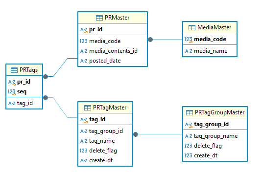

# pr_activities_view
広報活動(Public Relations Activities)の可視化

## Server
### DBテーブル定義
#### MediaMaster
cid | name | type | notnull | default | pk
---- | ---- | ---- | ---- | ---- | ----
0|media_code|INTEGER|1||1
1|media_name|TEXT|1||0

#### PRMaster
cid | name | type | notnull | default | pk
---- | ---- | ---- | ---- | ---- | ----
0|pr_id|TEXT|1||1
1|media_code|INTEGER|1||0
2|media_contents_id|TEXT|1||0
3|posted_date|TEXT|1|DATETIME('now')|0

#### PRTagGroupMaster
cid | name | type | notnull | default | pk
---- | ---- | ---- | ---- | ---- | ----
0|tag_group_id|TEXT|1||1
1|tag_group_name|TEXT|1||0
2|delete_flag|INTEGER|1|0|0
3|create_dt|INTEGER|1|DATETIME('now')|0

#### PRTagMaster
cid | name | type | notnull | default | pk
---- | ---- | ---- | ---- | ---- | ----
0|tag_id|TEXT|1||1
1|tag_group_id|TEXT|1||0
2|tag_name|TEXT|1||0
3|delete_flag|INTEGER|1|0|0
4|create_dt|TEXT|1|DATETIME('now')|0

#### PRTags
cid | name | type | notnull | default | pk
---- | ---- | ---- | ---- | ---- | ----
0|pr_id|TEXT|1||1
1|seq|INTEGER|1||2
2|tag_id|TEXT|1||0

### ER図

